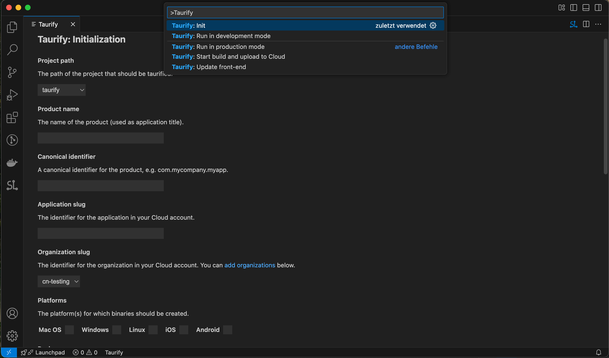

# vscode-taurify

The extension `vscode-taurify` lets you use [taurify](https://crabnebula.dev/taurify/) from the comfort of your favorite IDE. It enables you to develop and distribute native executables for all major platforms with automated updates using web app techniques.

## Features

### Integration

You will first notice a small `Taurify` status bar applet. If you don't want it, you can disable it in the configuration. Clicking on that applet will show the available taurify commands.

In the initialization view, you can also configure your organization's API keys. Those will be saved encrypted locally and only be transparently added to the environment of those commands that might need them.

### Initiliazation (init)

To taurify your project, just use the `vscode-taurify.init` command that opens a view to enable you configuring your project and your organization in the [CrabNebula Cloud](https://crabnebula.dev/cloud/), which is required for the distribution and updates.

### Run in development mode (dev)

The `vscode-taurify.dev` command runs your current application in development mode. If you have multiple applications in your workspace, it will ask you which one to run.

While the development mode is running, the status bar item will be shown in red.

### Run in production mode (run)

With `vscode-taurify.run`, you can run your current application locally as if it were in production mode. For multiple applications in your workspace, you'll be asked which one.

### Update full app (full-update)

To distribute the current state of the app as a new version, use the `vscode-taurify.full-update` command.

### Update front-end (frontend-update)

If only the front-end (the part running in the web view) changed, you can have an automatic over-the-wire update with the `vscode-taurify.frontend-update` call.

## Requirements

To build and distribute or push updates, you need an account for the [Crabnebula Cloud](https://crabnebula.dev/cloud/). Ideally, your project uses [vite](https://vitejs.dev) or a similar dev server and build chain.

A node package runner, `npx`, `pnpx` or `bunx` is also required.

## Extension Settings

While `vscode-taurify` will mostly run out of the box, you can configure the following settings:

* `taurify.showStatusBarApplet`: Enable/disable the status bar applet. Active by default.
* `taurify.enableLogs`: Enable writing output to a log file. Enabled by default.
* `taurify.logFile`: File to write log output to. Default is `.taurify/taurify.log`.
* `taurify.packageRunner`: Runner to run node packages with. Default is `npx`, `pnpx` and `bunx` are also supported.

## Known Issues

- Since this is a relatively new app, there are no known issues.

## Release Notes

### 0.0.1

Initial release
